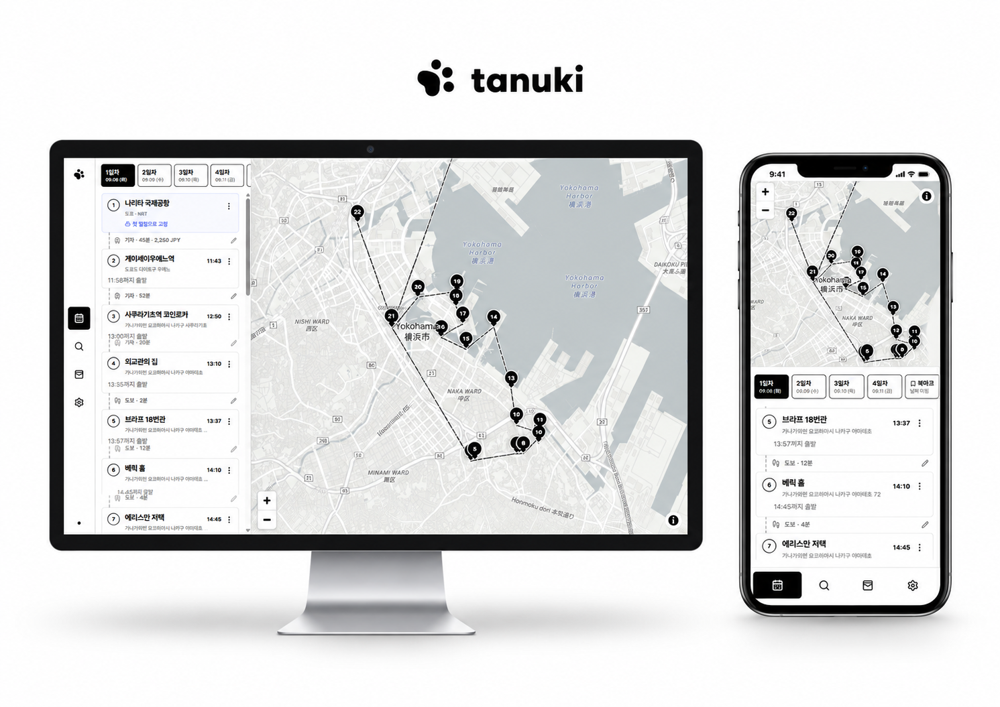
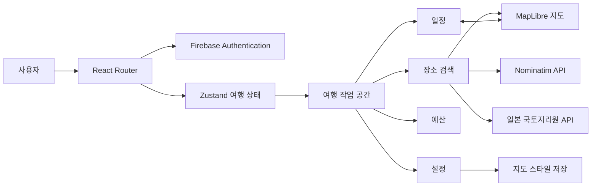

<p align="center">
  
</p>

Tanuki는 지도에서 찾은 장소를 일정에 배치하고, 이동 정보와 여행 경비를 함께 관리하는 여행 플래너입니다.

## 구현한 기능

| 기능 | 핵심 내용 |
| --- | --- |
| 여행 생성 | 국가, 날짜, 동행자, 왕복 교통편, 출도착 거점 설정 |
| 장소 검색 | Nominatim 및 일본 국토지리원 API, 검색어 정규화, 캐시와 요청 제어 |
| 지도 | MapLibre 지도, 일정 및 검색 결과와 마커 연동, 지도 스타일 저장 |
| 일정 | 날짜별 타임라인, 드래그 정렬, 일정 이동과 북마크, 도착 시간과 메모 |
| 이동 | 이동 수단, 소요 시간, 교통비, 교통 패스 기록 |
| 예산 | 전체 및 날짜별 지출, 비용 분류, 동행자별 균등 및 개별 정산 |
| 인증과 접근성 | Google 로그인, 보호 라우팅, 키보드 탐색, 포커스 복원, ARIA |

## 구조



## 기술 스택

| 구분      | 사용 기술                                    |
| --------- | -------------------------------------------- |
| UI        | React 19, TypeScript                         |
| 빌드      | Vite                                         |
| 라우팅    | React Router                                 |
| 상태 관리 | Zustand                                      |
| 지도      | MapLibre GL                                  |
| 장소 검색 | OpenStreetMap Nominatim, 일본 국토지리원 API |
| 인증      | Firebase Authentication                      |
| 테스트    | Vitest, Testing Library, jsdom               |
| 코드 품질 | Oxlint, Prettier                             |
| 배포      | GitHub Actions, GitHub Pages                 |

## 테스트

Vitest와 Testing Library로 일정, 비용, 검색, 인증과 사용자 입력을 검사합니다. 현재 테스트 파일 27개, 테스트 163개가 통과합니다.

```bash
npm run typecheck
npm run lint
npm test
npm run format:check
```

## 로컬 실행

CI에서는 Node.js 24를 사용합니다.

```bash
git clone https://github.com/tanuki-trip/tanuki-front.git
cd tanuki-front
npm ci
npm run dev
```

루트에 `.env.local` 파일을 만들고 Firebase 설정을 입력합니다.

```env
VITE_FIREBASE_API_KEY=
VITE_FIREBASE_AUTH_DOMAIN=
VITE_FIREBASE_PROJECT_ID=
VITE_FIREBASE_APP_ID=
VITE_FIREBASE_MESSAGING_SENDER_ID=

# 선택 사항
VITE_MAP_STYLE_URL=
```

Firebase 환경 변수가 없으면 게스트 화면까지 실행할 수 있지만 Google 로그인은 사용할 수 없습니다.
